# RB4InstrumentMapper

A program that maps packets from Xbox One instrument peripherals to virtual controllers, for use in games such as [Clone Hero](https://clonehero.net/).

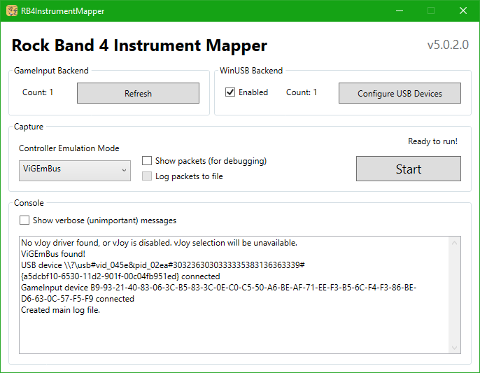

All Xbox One instruments are supported (RB4 guitars/drums, GHL guitar), along with the RB4 wireless legacy adapter.

## Table of Contents

- [Installation](#installation)
  - [ViGEmBus Setup](#vigembus-setup)
  - [vJoy Setup](#vjoy-setup)
- [Using Rock Band 4 Guitars and Drums](#using-rock-band-4-guitars-and-drums)
  - [Setup](#setup)
    - [Stratocaster, Jaguar, Drums](#stratocaster-jaguar-drums)
    - [Riffmaster](#riffmaster)
  - [Usage](#usage)
    - [Having Sync Issues?](#having-sync-issues)
- [Using Guitar Hero Live Guitars and RB4 Wireless Legacy Adapters](#using-guitar-hero-live-guitars-and-rb4-wireless-legacy-adapters)
  - [Setup](#setup-1)
  - [Usage](#usage-1)
- [Mapping your Controls](#mapping-your-controls)
  - [Clone Hero](#clone-hero)
  - [YARG](#yarg)
  - [GHWT: Definitive Edition](#ghwt-definitive-edition)
  - [RPCS3](#rpcs3)
- [Packet Logs](#packet-logs)
- [Error Logs](#error-logs)
- [Building](#building)
- [References](#references)
- [License](#license)

## Installation

1. Download and install RB4InstrumentMapper from [the Releases page](https://github.com/TheNathannator/RB4InstrumentMapper/releases).
2. Download and set up [ViGEmBus](https://github.com/ViGEm/ViGEmBus/releases/latest) or [vJoy](https://github.com/jshafer817/vJoy/releases/latest) using the guides below.
   - ViGEmBus is recommended, as it is significantly easier to use and requires no configuration. vJoy is supported as an alternative on the off-chance you run into issues with ViGEmBus.
   - Both can be installed simultaneously if desired, however RB4InstrumentMapper will only use one of them at a time.

### ViGEmBus Setup

1. Download and install [ViGEmBus](https://github.com/ViGEm/ViGEmBus/releases/latest).
2. That's all.

### vJoy Setup

1. Download and install [vJoy](https://github.com/jshafer817/vJoy/releases/latest).
2. After installing, open your Start menu, find the `vJoy` folder, and open the `Configure vJoy` program inside it.
3. Configure one device for each one of your controllers, using these settings:
   - Number of Buttons: 16
   - POV Hat Switch: Continuous, POVs: 1
   - Axes: `X`, `Y`, `Z`

   

4. Click Apply.
5. You're all set up!

---

## Using Rock Band 4 Guitars and Drums

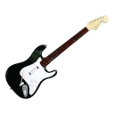
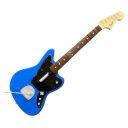
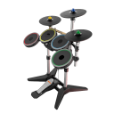
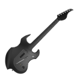

*Note that RB4InstrumentMapper is NOT required to use guitars in Fortnite!*

### Setup

#### Stratocaster, Jaguar, Drums

For wireless Rock Band 4 guitars and drums, you will need an Xbox One wireless receiver. Both versions of the official one are shown here:

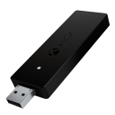
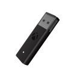

- This is *not* the same as an Xbox 360 wireless receiver! You must get an Xbox One (or just "Xbox") receiver, as shown above.
- Third-party receivers are untested, and they will not be deliberately supported.

Additionally, Jaguar guitars 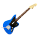 require a firmware update in order to connect to Xbox One receivers.

- [Instructions](https://bit.ly/2UHzonU)
- [Clone Hero wiki re-host](https://wiki.clonehero.net/link/61), in case the above link goes down again.

#### Riffmaster

For the Riffmaster, you will need its dedicated wireless dongle, pictured below:

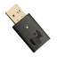

### Usage

1. In the `Controller Emulation Mode` dropdown, select the controller emulation mode you want to use.

   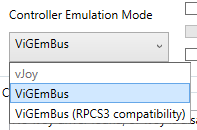

2. Hit the `Start` button to begin reading inputs.
3. Connect your instruments. They will be picked up and read automatically until you hit `Stop` or close the program.
   - Instruments can be connected before or after hitting Start, the ordering doesn't matter.
4. [Map your controls in the game you'll be playing](#mapping-your-controls).

#### Having Sync Issues?

Some guitars/drumkits might not sync properly when using just the sync button. This includes the PDP drumkit and occasionally the Jaguar guitar. Follow these steps to sync your device correctly:

1. Go to Windows settings > Devices > Bluetooth & other devices
2. Click `Add Bluetooth or other device` and pick the `Everything else` option.
3. Press and hold the sync button until the Xbox button light flashes quickly.
4. Select `Xbox compatible game controller` from the list once it appears.
5. If that doesn't work, restart your PC and try again.

---

## Using Guitar Hero Live Guitars and RB4 Wireless Legacy Adapters

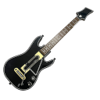
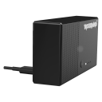

### Setup

You will need to install the WinUSB driver onto the Guitar Hero Live dongle or Rock Band 4 wireless legacy adapter before using it. RB4InstrumentMapper is capable of doing this directly, through the `Configure Devices` button on its main menu:

1. Check the `Enable` checkbox under the `USB` group, then click the `Configure Devices` button underneath it.

   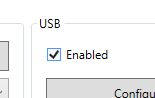

2. Find the device you want to use on the left side of the menu.

   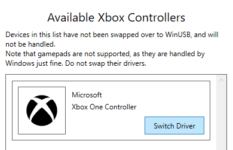

3. Click the `Switch Driver` button and wait for it to switch the driver. The device will show up on the right side of the menu once it's done.

   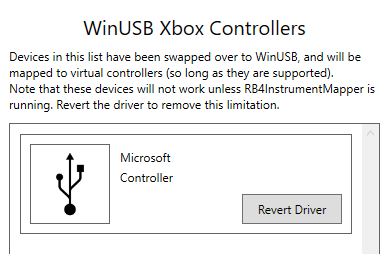

   - Note that games that natively support the device will no longer work directly with it until you uninstall the WinUSB driver. Hit the `Revert Driver` button on the device to do so, after which those games will work with it again.

If you run into any issues with this process, you may try [installing the driver manually](Docs/WinUSB/manual-winusb-install.md). This is not recommended for normal use, it should only be used if the Configure Devices menu is not working.
- This also covers [uninstalling manually](Docs/WinUSB/manual-winusb-install.md#remove-winusb), in case a device gets stuck with the driver installed and RB4InstrumentMapper stops picking it up.

### Usage

1. Check the `Enable` checkbox under the `USB` group.

   

2. **Ensure you have [installed WinUSB](#setup-1) on the devices you want to use! They will not be recognized otherwise!**
3. In the `Controller Emulation Mode` dropdown, select the controller emulation mode you want to use.

   

4. Hit the `Start` button to begin reading inputs.
5. [Map your controls in the game you'll be playing](#mapping-your-controls).

Devices will be detected automatically as they are connected/removed, though they will not be read until you hit Start.

If you are having issues with inputs not being registered or other general weirdness, try unplugging and replugging the dongle/cable. Unfortunately this backend is still finnicky, so things may not work the smoothest.

---

## Mapping your Controls

Now that RB4InstrumentMapper is set up and running, map your controls for each instrument in the game you'll be playing.

### Clone Hero

If you're using a guitar in ViGEmBus mode, Clone Hero will automatically map your controls. You shouldn't need to do any manual mapping, unless you're using a Guitar Hero Live guitar, in which case you may need to swap your whammy and tilt bindings.

- This automatic mapping will also apply to drumkits, however here the bindings will not be correct, as they are meant for guitars. You will need to remove the default bindings and do them manually.

For drumkits, vJoy mode, or if you otherwise need to customize your controls:

1. Press Space on the main menu.

   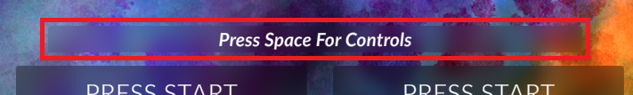

2. Click Assign Controller and press a button on the device for it to be assigned.

   

3. Click the slots in the `Controller` column to map each of the controls.

   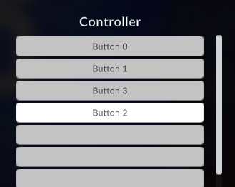

4. Repeat for each connected device.
5. Click `Done`.

If you require further help with mapping, you can ask in the [Clone Hero Discord server](https://discord.gg/Hsn4Cgu).

### YARG

Refer to the [official documentation](https://docs.yarg.in/en/profiles).

### GHWT: Definitive Edition

Refer to the [official documentation](https://ghwt.de/wiki/#/wtde/binding?id=binding-controllers).

### RPCS3

1. For RPCS3, use the `ViGEmBus (RPCS3 compatibility)` controller mode. This will change the mappings that RB4InstrumentMapper outputs so that little to no remapping is required to use instruments in RPCS3.

   

2. Open the Gamepad Configuration Menu in RPCS3

   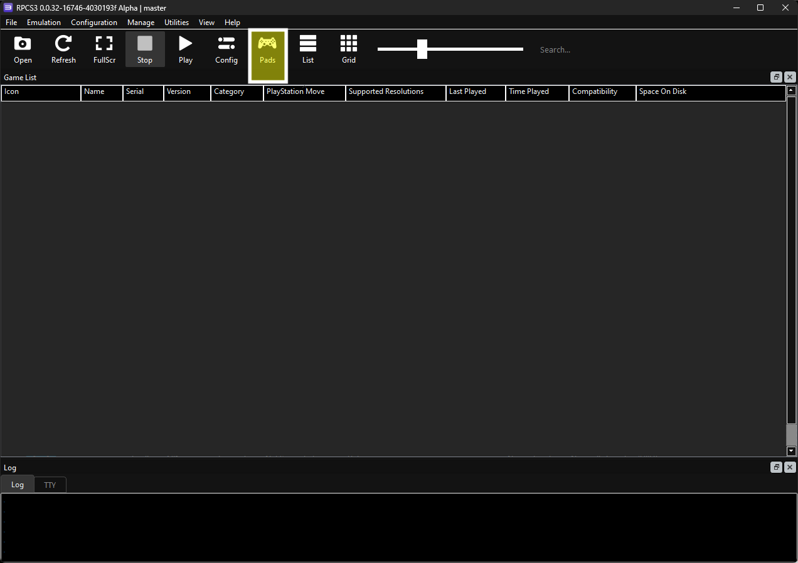

3. Change the `Handlers` to "XInput", pick your instrument under `Devices`, and set `Device Class` to "Rock Band - Guitar" if you're using a guitar or 'Rock Band - Drums' if you're using drums.

   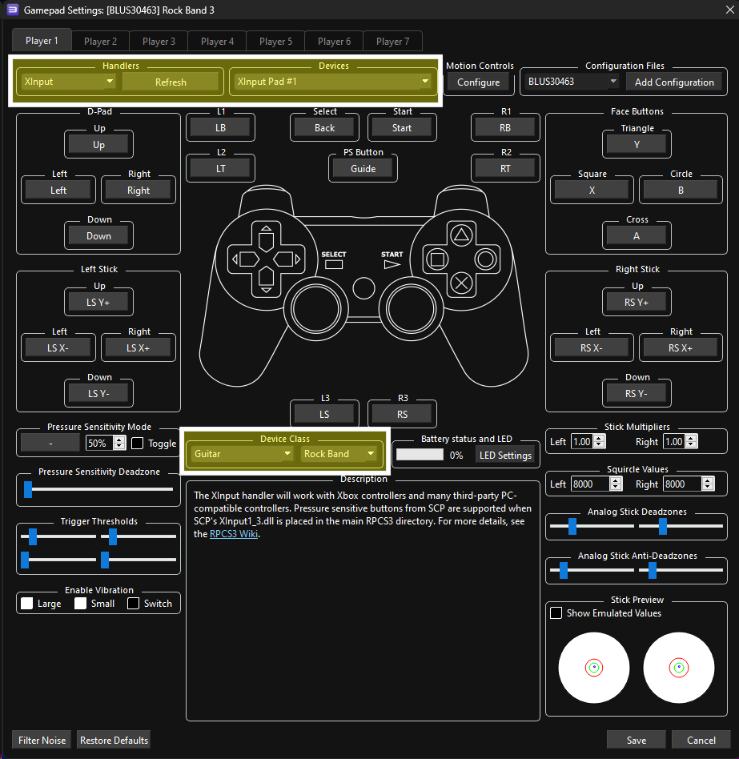

4. Repeat for each connected device in the other Player tabs.
5. Click `Done`.

## Packet Logs

RB4InstrumentMapper is capable of logging packets to a file for debugging purposes. To do so, enable both the `Show Packets (for debugging)` and `Log packets to file` checkboxes, then hit Start. Packet logs get saved to a `RB4InstrumentMapper` > `PacketLogs` folder inside your Documents folder. Make sure to include it when getting help or creating an issue report for packet parsing issues.

Note that these settings are meant for debugging purposes only, leaving them enabled can reduce the performance of the program somewhat.

## Error Logs

In the case that the program crashes, an error log is saved to a `RB4InstrumentMapper` > `Logs` folder inside your Documents folder. Make sure to include it when getting help or creating an issue report for the crash.

## Building

To build this program, you will need:

- Visual Studio, or MSBuild/[the .NET SDK](https://dotnet.microsoft.com/en-us/download) + your code editor of choice.
- [WiX Toolset v4](https://wixtoolset.org/) if you wish to build the installer.

## References

Predecessors:

- [GuitarSniffer repository](https://github.com/artman41/guitarsniffer)
- [DrumSniffer repository](https://github.com/Dunkalunk/guitarsniffer)

Packet data:

- [GuitarSniffer guitar packet logs](https://1drv.ms/f/s!AgQGk0OeTMLwhA-uDO9IQHEHqGhv)
- GuitarSniffer guitar packet spreadsheets: [New](https://docs.google.com/spreadsheets/d/1ITZUvRniGpfS_HV_rBpSwlDdGukc3GC1CeOe7SavQBo/edit?usp=sharing), [Old](https://1drv.ms/x/s!AgQGk0OeTMLwg3GBDXFUC3Erj4Wb)
- [rb4.app's Javascript source](https://rb4.app/js/app.js)
- Original research, found in the [PlasticBand documentation repository](https://github.com/TheNathannator/PlasticBand).

## License

This program is licensed under the MIT license. See [LICENSE](LICENSE) for details.
